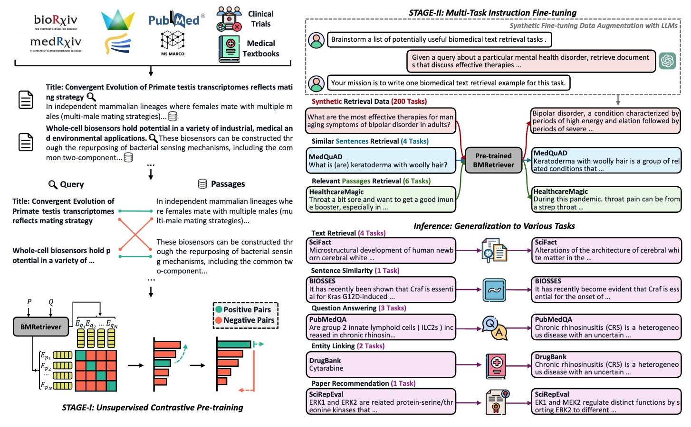

# BMRetriever

This is the model and data for the paper **BMRetriever: Tuning Large Language Models as Better Biomedical Text Retrievers**. The associated HuggingFace repository is available here https://huggingface.co/BMRetriever.

See the paper [link](https://arxiv.org/abs/2404.18443) for details.

**Update on 06/24/24**: We have added a script `eval.py` for reproducing our experimental results on BEIR benchmarks. We have also provided the prompt (instructions) we used in experiments in `prompt.py`. Please use `torchrun --nproc-per-node=1 eval.py` for running the code.

## Model Specifications

Below is a table that outlines the various parameters and configurations for the models ranging from 410M to 7B in size.

| Parameters       | 410M        | 1B           | 2B           | 7B               |
|------------------|-------------|--------------|--------------|------------------|
| **Backbone**     | Pythia [1]  | Pythia [1]   | Gemma [2]    | BioMistral [3]   |
| **Model Layers** | 24          | 16           | 18           | 32               |
| **Embedding Dim.** | 1024      | 2048         | 2048         | 4096             |
| **Avg. Perf. on 5 Retrieval Tasks** |    0.574   |  0.596    |   0.600     |    0.610         |
| **Avg. Perf. on 6 Retrieval Applications** |     0.725  |     0.741    |     0.775    |  0.793         |
| **Link** |    [BMRetriever/BMRetriever-410M](https://huggingface.co/BMRetriever/BMRetriever-410M)   |  [BMRetriever/BMRetriever-1B](https://huggingface.co/BMRetriever/BMRetriever-1B)    |  [BMRetriever/BMRetriever-2B](https://huggingface.co/BMRetriever/BMRetriever-2B)     |    [BMRetriever/BMRetriever-7B](https://huggingface.co/BMRetriever/BMRetriever-7B)         |


### References

1. **Pythia** - [Pythia](https://huggingface.co/models?other=pythia)
2. **Gemma** - [Gemma](https://huggingface.co/google/gemma-2b)
3. **BioMistral** - [BioMistral](https://huggingface.co/BioMistral/BioMistral-7B)

## Overview


## Model Usage

Pre-trained models can be loaded through the HuggingFace transformers library:

```python
from transformers import AutoModel, AutoTokenizer

model = AutoModel.from_pretrained("BMRetriever/BMRetriever-410M") 
tokenizer = AutoTokenizer.from_pretrained("BMRetriever/BMRetriever-410M") 
```

Then embeddings for different sentences can be obtained by doing the following:

```python
import torch
import torch.nn.functional as F

from torch import Tensor
from transformers import AutoTokenizer, AutoModel


def last_token_pool(last_hidden_states: Tensor,
                 attention_mask: Tensor) -> Tensor:
    last_hidden = last_hidden_states.masked_fill(~attention_mask[..., None].bool(), 0.0)
    left_padding = (attention_mask[:, -1].sum() == attention_mask.shape[0])
    if left_padding:
        embedding = last_hidden[:, -1]
    else:
        sequence_lengths = attention_mask.sum(dim=1) - 1
        batch_size = last_hidden.shape[0]
        embedding = last_hidden[torch.arange(batch_size, device=last_hidden.device), sequence_lengths]
    return embedding
    
def get_detailed_instruct_query(task_description: str, query: str) -> str:
    return f'{task_description}\nQuery: {query}'

def get_detailed_instruct_passage(passage: str) -> str:
    return f'Represent this passage\npassage: {passage}'

# Each query must come with a one-sentence instruction that describes the task
task = 'Given a scientific claim, retrieve documents that support or refute the claim'
queries = [
    get_detailed_instruct_query(task, 'Cis-acting lncRNAs control the expression of genes that are positioned in the vicinity of their transcription sites.'),
    get_detailed_instruct_query(task, 'Forkhead 0 (fox0) transcription factors are involved in apoptosis.')
]

# No need to add instruction for retrieval documents
documents = [
    get_detailed_instruct_passage("Gene regulation by the act of long non-coding RNA transcription Long non-protein-coding RNAs (lncRNAs) are proposed to be the largest transcript class in the mouse and human transcriptomes. Two important questions are whether all lncRNAs are functional and how they could exert a function. Several lncRNAs have been shown to function through their product, but this is not the only possible mode of action. In this review we focus on a role for the process of lncRNA transcription, independent of the lncRNA product, in regulating protein-coding-gene activity in cis. We discuss examples where lncRNA transcription leads to gene silencing or activation, and describe strategies to determine if the lncRNA product or its transcription causes the regulatory effect."),
    get_detailed_instruct_passage("Noncoding transcription at enhancers: general principles and functional models. Mammalian genomes are extensively transcribed outside the borders of protein-coding genes. Genome-wide studies recently demonstrated that cis-regulatory genomic elements implicated in transcriptional control, such as enhancers and locus-control regions, represent major sites of extragenic noncoding transcription. Enhancer-templated transcripts provide a quantitatively small contribution to the total amount of cellular nonribosomal RNA; nevertheless, the possibility that enhancer transcription and the resulting enhancer RNAs may, in some cases, have functional roles, rather than represent mere transcriptional noise at accessible genomic regions, is supported by an increasing amount of experimental data. In this article we review the current knowledge on enhancer transcription and its functional implications.")
]
input_texts = queries + documents

max_length = 512

# Tokenize the input texts
batch_dict = tokenizer(input_texts, max_length=max_length-1, padding=True, truncation=True, return_tensors='pt')

# Important! Adding EOS token at the end
batch_dict['input_ids'] = [input_ids + [tokenizer.eos_token_id] for input_ids in batch_dict['input_ids']]
batch_dict = tokenizer.pad(batch_dict, padding=True, return_attention_mask=True, return_tensors='pt').to("cuda")

model.eval()
with torch.no_grad():
    outputs = model(**batch_dict)
    embeddings = last_token_pool(outputs.last_hidden_state, batch_dict['attention_mask'])
```

Then similarity scores between the different sentences are obtained with a dot product between the embeddings:

```python
scores = (embeddings[:2] @ embeddings[2:].T)
print(scores.tolist())
```

## Data Usage
We have also made available the instruction fine-tuning dataset to aid in reproducibility. This dataset encompasses a range of biomedical tasks with varying levels of detail. It includes sentence-level tasks such as medical natural language inference (MedNLI) and medical question pairs, as well as passage-level biomedical QA tasks like MedMCQA, StackExchange, and medical dialogues. Additionally, we have included several general-domain retrieval datasets, such as MS MARCO, NQ, Fever, ELI5, and NLI, to improve the model's capacity for relevance estimation.

The total volume of data is around 1.4M pairs. The data is also available at [huggingface](https://huggingface.co/datasets/BMRetriever/biomed_retrieval_dataset). Note that for each query, the negative is mined by sampling over the top 100 documents using E5 that do not appear in positive documents.

## Citation
If you find this repository helpful, please kindly consider citing the corresponding paper. Thanks!
```
@misc{xu2024bmretriever,
      title={BMRetriever: Tuning Large Language Models as Better Biomedical Text Retrievers}, 
      author={Ran Xu and Wenqi Shi and Yue Yu and Yuchen Zhuang and Yanqiao Zhu and May D. Wang and Joyce C. Ho and Chao Zhang and Carl Yang},
      year={2024},
      eprint={2404.18443},
      archivePrefix={arXiv},
      primaryClass={cs.CL}
}
```

## Acknowledgement
We would like to thank the authors from E5-Mistral and Tevatron for the open-sourcing efforts.
